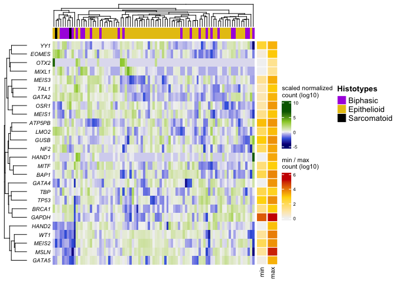

R Notebook
================

#### Loading packages

``` r
library(circlize)
```

    ## ========================================
    ## circlize version 0.4.14
    ## CRAN page: https://cran.r-project.org/package=circlize
    ## Github page: https://github.com/jokergoo/circlize
    ## Documentation: https://jokergoo.github.io/circlize_book/book/
    ## 
    ## If you use it in published research, please cite:
    ## Gu, Z. circlize implements and enhances circular visualization
    ##   in R. Bioinformatics 2014.
    ## 
    ## This message can be suppressed by:
    ##   suppressPackageStartupMessages(library(circlize))
    ## ========================================

``` r
library(ComplexHeatmap)
```

    ## Loading required package: grid

    ## ========================================
    ## ComplexHeatmap version 2.11.1
    ## Bioconductor page: http://bioconductor.org/packages/ComplexHeatmap/
    ## Github page: https://github.com/jokergoo/ComplexHeatmap
    ## Documentation: http://jokergoo.github.io/ComplexHeatmap-reference
    ## 
    ## If you use it in published research, please cite:
    ## Gu, Z. Complex heatmaps reveal patterns and correlations in multidimensional 
    ##   genomic data. Bioinformatics 2016.
    ## 
    ## The new InteractiveComplexHeatmap package can directly export static 
    ## complex heatmaps into an interactive Shiny app with zero effort. Have a try!
    ## 
    ## This message can be suppressed by:
    ##   suppressPackageStartupMessages(library(ComplexHeatmap))
    ## ========================================

``` r
library(ggplot2)
library(matrixStats)
library(scales)
library(viridis)
```

    ## Loading required package: viridisLite

    ## 
    ## Attaching package: 'viridis'

    ## The following object is masked from 'package:scales':
    ## 
    ##     viridis_pal

#### Read in mRNA expression table, RSEM(Batch normalized from Illumina)

``` r
z_5 <- read.csv(file = "data/TCGA_meso_version3b.csv", header=TRUE, row.names = 1, check.names = FALSE)
z_5 <- as.matrix(z_5)

z_5.dft <- as.data.frame(t(z_5))
```

#### Creating min/max legend

``` r
df_5 <- data.frame(    
  min = log10(rowMins(z_5)+1),
  max = log10(rowMaxs(z_5)+1))

df_group <- data.frame(rownames(z_5.dft))
df_group$group <- NULL
df_group$group <- ifelse(grepl("Epithelioid",df_group$rownames.z_5.dft.,fixed=T),
       "Epithelioid",
       ifelse(grepl("Biphasic",df_group$rownames.z_5.dft., fixed = T),
              "Biphasic",
              ifelse(grepl("Sarcomatoid",df_group$rownames.z_5.dft.,fixed = T),
                     "Sarcomatoid",
                     "NA")
              )
       )
df_group <- data.frame(df_group$group)
```

#### creating top annotations by column

``` r
ha = HeatmapAnnotation(df = df_group,
                       which = 'column',
                       col = list(df_group.group = c("Epithelioid" = "#e7c313","Biphasic" = "#ab32e0","Sarcomatoid" = "black")),
                       show_annotation_name = FALSE,
                       annotation_legend_param = list(title = "Histotypes")
                      )
```

#### assigning colors to the scale bar in min/max count legend

``` r
qs <- quantile(unlist(df_5), c(0,.5,1))
anno_pal <- colorRamp2(qs, c("grey95", "gold", "red3"))
```

#### row annotation

``` r
row_anno <- rowAnnotation(df = df_5,
                          simple_anno_size = unit(4.5, "mm"),
                          col = list(min = anno_pal, max = anno_pal),
                          gp = gpar(col = "white"),
                          show_legend = c(TRUE, FALSE),
                          annotation_name_gp = gpar(fontsize = 8),
                          annotation_legend_param = list(
                            min = list(
                              title = "min / max\ncount (log10)",
                              title_gp = gpar(fontsize = 8),
                              labels_gp = gpar(fontsize = 6))))
```

#### creating matrix

``` r
mat_5 <- t(scale(t(log10(z_5+1))))
```

#### creating colors for visualization of data matrix

``` r
min <- floor(min(mat_5)*2)/2
max <- ceiling(max(mat_5)*2)/2

hm_pal <- c("navy", "royalblue", "grey95", "yellowgreen", "darkgreen")
hm_pal <- colorRamp2(c(min, min/2, 0, max/2, max), hm_pal)
```

#### Creating heatmap. visualization the heatmap

``` r
hm_18 <- Heatmap(matrix = mat_5, col = hm_pal,
                 row_names_side = "left",
                 right_annotation = row_anno,
                 row_names_gp = gpar(fontsize = 7, fontface = "italic"),
                 show_column_names = FALSE,
                 column_names_gp = gpar(fontsize = 5),
                 heatmap_legend_param = list(
                   title = "scaled normalized\ncount (log10)",
                   title_gp = gpar(fontsize = 8),
                   labels_gp = gpar(fontsize = 6)),
                 clustering_distance_rows = "euclidean",
                 clustering_distance_columns = "euclidean",
                 row_dend_reorder = T,
                 column_dend_reorder = T,
                 top_annotation = ha)
    

hm_18
```

<!-- -->

``` r
hm_18 <- grid.grabExpr(draw(hm_18))
ggsave(filename = "results/heatmap18.pdf", hm_18, width = 20, height = 10.5, units = "cm")
```

``` r
sessionInfo()
```

    ## R version 4.1.0 (2021-05-18)
    ## Platform: x86_64-apple-darwin17.0 (64-bit)
    ## Running under: macOS Big Sur 10.16
    ## 
    ## Matrix products: default
    ## BLAS:   /Library/Frameworks/R.framework/Versions/4.1/Resources/lib/libRblas.dylib
    ## LAPACK: /Library/Frameworks/R.framework/Versions/4.1/Resources/lib/libRlapack.dylib
    ## 
    ## locale:
    ## [1] en_US.UTF-8/en_US.UTF-8/en_US.UTF-8/C/en_US.UTF-8/en_US.UTF-8
    ## 
    ## attached base packages:
    ## [1] grid      stats     graphics  grDevices utils     datasets  methods  
    ## [8] base     
    ## 
    ## other attached packages:
    ## [1] viridis_0.6.2         viridisLite_0.4.0     scales_1.1.1         
    ## [4] matrixStats_0.61.0    ggplot2_3.3.5         ComplexHeatmap_2.11.1
    ## [7] circlize_0.4.14      
    ## 
    ## loaded via a namespace (and not attached):
    ##  [1] shape_1.4.6         GetoptLong_1.0.5    tidyselect_1.1.1   
    ##  [4] xfun_0.27           purrr_0.3.4         colorspace_2.0-2   
    ##  [7] vctrs_0.3.8         generics_0.1.1      htmltools_0.5.2    
    ## [10] stats4_4.1.0        yaml_2.2.1          utf8_1.2.2         
    ## [13] rlang_0.4.12        pillar_1.6.4        glue_1.5.0         
    ## [16] withr_2.4.2         DBI_1.1.1           BiocGenerics_0.40.0
    ## [19] RColorBrewer_1.1-2  foreach_1.5.1       lifecycle_1.0.1    
    ## [22] stringr_1.4.0       munsell_0.5.0       gtable_0.3.0       
    ## [25] GlobalOptions_0.1.2 codetools_0.2-18    evaluate_0.14      
    ## [28] knitr_1.36          IRanges_2.28.0      fastmap_1.1.0      
    ## [31] doParallel_1.0.16   parallel_4.1.0      fansi_0.5.0        
    ## [34] highr_0.9           S4Vectors_0.32.0    gridExtra_2.3      
    ## [37] rjson_0.2.20        png_0.1-7           digest_0.6.28      
    ## [40] stringi_1.7.5       dplyr_1.0.7         clue_0.3-60        
    ## [43] tools_4.1.0         magrittr_2.0.1      tibble_3.1.6       
    ## [46] cluster_2.1.2       crayon_1.4.2        pkgconfig_2.0.3    
    ## [49] ellipsis_0.3.2      assertthat_0.2.1    rmarkdown_2.11     
    ## [52] iterators_1.0.13    R6_2.5.1            compiler_4.1.0
