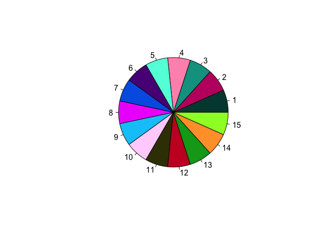
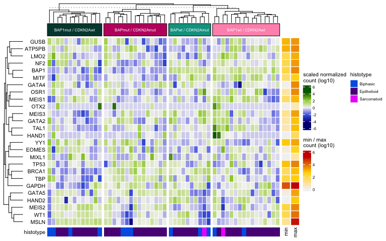
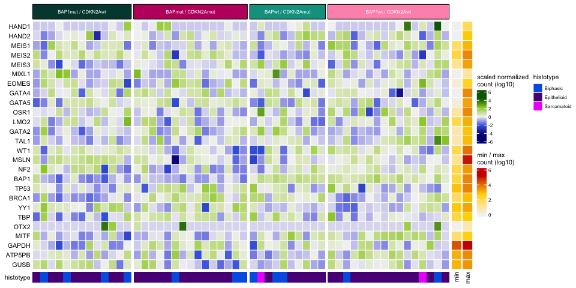

Hand2 heatmap R Notebook
================

# Libraries and palette

``` r
library(circlize)
```

    ## ========================================
    ## circlize version 0.4.14
    ## CRAN page: https://cran.r-project.org/package=circlize
    ## Github page: https://github.com/jokergoo/circlize
    ## Documentation: https://jokergoo.github.io/circlize_book/book/
    ## 
    ## If you use it in published research, please cite:
    ## Gu, Z. circlize implements and enhances circular visualization
    ##   in R. Bioinformatics 2014.
    ## 
    ## This message can be suppressed by:
    ##   suppressPackageStartupMessages(library(circlize))
    ## ========================================

``` r
library(ComplexHeatmap)
```

    ## Loading required package: grid

    ## ========================================
    ## ComplexHeatmap version 2.11.1
    ## Bioconductor page: http://bioconductor.org/packages/ComplexHeatmap/
    ## Github page: https://github.com/jokergoo/ComplexHeatmap
    ## Documentation: http://jokergoo.github.io/ComplexHeatmap-reference
    ## 
    ## If you use it in published research, please cite:
    ## Gu, Z. Complex heatmaps reveal patterns and correlations in multidimensional 
    ##   genomic data. Bioinformatics 2016.
    ## 
    ## The new InteractiveComplexHeatmap package can directly export static 
    ## complex heatmaps into an interactive Shiny app with zero effort. Have a try!
    ## 
    ## This message can be suppressed by:
    ##   suppressPackageStartupMessages(library(ComplexHeatmap))
    ## ========================================

``` r
library(matrixStats)
library(scales)
library(viridis)
```

    ## Loading required package: viridisLite

    ## 
    ## Attaching package: 'viridis'

    ## The following object is masked from 'package:scales':
    ## 
    ##     viridis_pal

``` r
library(tidyverse)
```

    ## ── Attaching packages ─────────────────────────────────────── tidyverse 1.3.1 ──

    ## ✓ ggplot2 3.3.5     ✓ purrr   0.3.4
    ## ✓ tibble  3.1.6     ✓ dplyr   1.0.7
    ## ✓ tidyr   1.1.4     ✓ stringr 1.4.0
    ## ✓ readr   2.0.2     ✓ forcats 0.5.1

    ## ── Conflicts ────────────────────────────────────────── tidyverse_conflicts() ──
    ## x readr::col_factor() masks scales::col_factor()
    ## x dplyr::count()      masks matrixStats::count()
    ## x purrr::discard()    masks scales::discard()
    ## x dplyr::filter()     masks stats::filter()
    ## x dplyr::lag()        masks stats::lag()

## Here’s a color blind friendly palette

``` r
cbpal15 <- c("#00463C","#C00B6F","#00A090","#FF95BA","#5FFFDE",
           "#590A87","#0063E5","#ED0DFD","#00C7F9","#FFD5FD",
           "#3D3C04","#C80B2A","#00A51C","#FFA035","#9BFF2D")
p3 <- pie(rep(1,15), col =cbpal15)
```

<!-- --> \# Data

## This section reads in the data and tidys them to make one tibble, expression\_meso, with all the data

To include all samples and call the ones missing mutation\_subgroup data
“unknown”, use full\_join. To include only samples with
mutation\_subgroup data use right\_join (because it’s the second tibble
that has the lesser number of samples) and then left\_join to histotypes

``` r
expression_meso <- read.csv(file = "data/TCGA_meso_version3b_RV2.csv")
expression_meso <- as_tibble(expression_meso)
mutation_subgroups <- readxl::read_xlsx(path = "data/TCGA_stratification_Hand2_ms_26_03_2021_EFB.xlsx", col_names = TRUE)
```

    ## New names:
    ## * `` -> ...5
    ## * `` -> ...6
    ## * `` -> ...7
    ## * `` -> ...9
    ## * `` -> ...11
    ## * ...

``` r
mutation_subgroups <- mutation_subgroups[,c(1,2,8,15)] %>%
  rename("SAMPLE_ID" = "BAP1", "BAP1" = "BAP1 2 hits") %>%
  mutate(Subgroup = case_when(BAP1 == "WT" & CDKN2A == "WT" ~ "BAP1+/+ CDKN2A+/+",
                              BAP1 == "WT" & CDKN2A == "M" ~ "BAP1+/+ CDKN2A-/-",
                              BAP1 == "M" & CDKN2A == "WT" ~ "BAP1-/- CDKN2A +/+",
                              BAP1 == "M" & CDKN2A == "M" ~ "BAP1-/- CDKN2A-/-")) %>%
  select(SAMPLE_ID, Subgroup)
histotypes <- read.table(file = "data/Cancer_Type_Detailed_together with TCGAversion3b.txt", sep = "\t", header = T)
histotypes <- as_tibble(histotypes) %>%
  rename(SAMPLE_ID = Patient.ID) %>%
  mutate(histotype = word(Cancer.Type.Detailed,-2)) %>%
  select(SAMPLE_ID, histotype)
expression_meso <- right_join(expression_meso, mutation_subgroups, by = "SAMPLE_ID") %>%
  left_join(histotypes, by = "SAMPLE_ID") %>%
  arrange(Subgroup)

# expression_meso <- full_join(expression_meso, mutation_subgroups, by = "SAMPLE_ID") %>%
#   full_join(histotypes, by = "SAMPLE_ID") %>%
#   mutate(Subgroup = replace_na(Subgroup, "unknown")) %>%
#   arrange(Subgroup)
```

## Create the expression matrix with only numeric values to use in Heatmap()

``` r
expression_meso.t <- t(expression_meso)
colnames(expression_meso.t) <- expression_meso.t['Subgroup',]
expression_matrix <- as.matrix(expression_meso.t[2:27,])
class(expression_matrix) <- "numeric"
```

# Heatmap

## Create the top column annotation by mutation subgroup

If using full\_join and adding “unknown” mutation subgroup use commented
out code

``` r
col_anno <- columnAnnotation(
  foo = anno_block(           #block annotation
    gp = gpar(fill = cbpal15[1:4]), #fill = c("F8766D) #show_col(hue_pal()(8)) #which color
    labels = c(
      "BAP1mut / CDKN2Awt",
      "BAPmut / CDKN2Amut",
      "BAPwt / CDKN2Amut",
      "BAP1wt / CDKN2Awt"),
    labels_gp = gpar(col = "white", fontsize = 6)))
```

## Create the bottom annotation by histotype

``` r
bottom_anno <- HeatmapAnnotation(histotype = expression_meso$histotype,
    col = list(histotype = c("Epithelioid" = cbpal15[6], "Biphasic" = cbpal15[7], "Sarcomatoid" = cbpal15[8])),
    annotation_name_side = "left",
    annotation_name_gp = gpar(fontsize = 8),
                          annotation_legend_param = list(
                            histotype = list(
                              title = "histotype",
                              title_gp = gpar(fontsize = 8),
                              labels_gp = gpar(fontsize = 6))))
```

## Create row min/max annotation

``` r
df <- data.frame(
  min = log10(rowMins(expression_matrix)+1),
  max = log10(rowMaxs(expression_matrix)+1))

qs <- quantile(unlist(df), c(0,.5,1))    #  

anno_pal <- colorRamp2(qs, c("grey95", "gold", "red3"))

#row annotations
row_anno <- rowAnnotation(df = df,
                          simple_anno_size = unit(4.5, "mm"),
                          col = list(min = anno_pal, max = anno_pal),
                          gp = gpar(col = "white"),
                          show_legend = c(TRUE, FALSE),
                          annotation_name_gp = gpar(fontsize = 8),
                          annotation_legend_param = list(
                            min = list(
                              title = "min / max\ncount (log10)",
                              title_gp = gpar(fontsize = 8),
                              labels_gp = gpar(fontsize = 6))))

mat <- t(scale(t(log10(expression_matrix+1))))
min <- floor(min(mat)*2)/2
max <- ceiling(max(mat)*2)/2
hm_pal <- c("navy", "royalblue", "grey95", "yellowgreen", "darkgreen")
hm_pal <- colorRamp2(c(min, min/2, 0, max/2, max), hm_pal)
```

## Create heatmap with top mutation group annotation and clustering, bottom histotype annotation, left names and right min/max annotation

``` r
hm <- Heatmap(
  matrix = mat,
  col = hm_pal,
  row_names_side = "left",
  top_annotation = col_anno,
  right_annotation = row_anno,
  bottom_annotation = bottom_anno,
  rect_gp = gpar(col = "white"),
  row_names_gp = gpar(fontsize = 8),
  heatmap_legend_param = list(
    title = "scaled normalized\ncount (log10)",
    title_gp = gpar(fontsize = 8),
    labels_gp = gpar(fontsize = 6)),
  column_split = colnames(expression_matrix),
  column_title = NULL,
  show_column_names = FALSE)

hm
```

<!-- -->

``` r
hm <- grid.grabExpr(draw(hm))
ggsave(filename = "results/figures_sup9B.heatmap.pdf", plot = hm, width = 8)
```

    ## Saving 8 x 5 in image

## Heatmap without clustering to aid in sanity check of correct annotations going with samples

``` r
hm <- Heatmap(
  matrix = mat,
  cluster_rows = F,
  cluster_columns = F,
  cluster_column_slices = F,
  col = hm_pal,
  row_names_side = "left",
  top_annotation = col_anno,
  right_annotation = row_anno,
  bottom_annotation = bottom_anno,
  rect_gp = gpar(col = "white"),
  row_names_gp = gpar(fontsize = 8),
  heatmap_legend_param = list(
    title = "scaled normalized\ncount (log10)",
    title_gp = gpar(fontsize = 8),
    labels_gp = gpar(fontsize = 6)),
  column_split = colnames(expression_matrix),
  column_title = NULL,
  show_column_names = FALSE)

hm
```

<!-- -->

``` r
sessionInfo()
```

    ## R version 4.1.0 (2021-05-18)
    ## Platform: x86_64-apple-darwin17.0 (64-bit)
    ## Running under: macOS Big Sur 10.16
    ## 
    ## Matrix products: default
    ## BLAS:   /Library/Frameworks/R.framework/Versions/4.1/Resources/lib/libRblas.dylib
    ## LAPACK: /Library/Frameworks/R.framework/Versions/4.1/Resources/lib/libRlapack.dylib
    ## 
    ## locale:
    ## [1] en_US.UTF-8/en_US.UTF-8/en_US.UTF-8/C/en_US.UTF-8/en_US.UTF-8
    ## 
    ## attached base packages:
    ## [1] grid      stats     graphics  grDevices utils     datasets  methods  
    ## [8] base     
    ## 
    ## other attached packages:
    ##  [1] forcats_0.5.1         stringr_1.4.0         dplyr_1.0.7          
    ##  [4] purrr_0.3.4           readr_2.0.2           tidyr_1.1.4          
    ##  [7] tibble_3.1.6          ggplot2_3.3.5         tidyverse_1.3.1      
    ## [10] viridis_0.6.2         viridisLite_0.4.0     scales_1.1.1         
    ## [13] matrixStats_0.61.0    ComplexHeatmap_2.11.1 circlize_0.4.14      
    ## 
    ## loaded via a namespace (and not attached):
    ##  [1] httr_1.4.2          jsonlite_1.7.2      foreach_1.5.1      
    ##  [4] modelr_0.1.8        assertthat_0.2.1    highr_0.9          
    ##  [7] stats4_4.1.0        cellranger_1.1.0    yaml_2.2.1         
    ## [10] pillar_1.6.4        backports_1.3.0     glue_1.5.0         
    ## [13] digest_0.6.28       RColorBrewer_1.1-2  rvest_1.0.2        
    ## [16] colorspace_2.0-2    htmltools_0.5.2     pkgconfig_2.0.3    
    ## [19] GetoptLong_1.0.5    broom_0.7.10        haven_2.4.3        
    ## [22] tzdb_0.2.0          generics_0.1.1      IRanges_2.28.0     
    ## [25] ellipsis_0.3.2      withr_2.4.2         BiocGenerics_0.40.0
    ## [28] cli_3.1.0           magrittr_2.0.1      crayon_1.4.2       
    ## [31] readxl_1.3.1        evaluate_0.14       fs_1.5.0           
    ## [34] fansi_0.5.0         doParallel_1.0.16   xml2_1.3.2         
    ## [37] tools_4.1.0         hms_1.1.1           GlobalOptions_0.1.2
    ## [40] lifecycle_1.0.1     S4Vectors_0.32.0    munsell_0.5.0      
    ## [43] reprex_2.0.1        cluster_2.1.2       compiler_4.1.0     
    ## [46] rlang_0.4.12        iterators_1.0.13    rstudioapi_0.13    
    ## [49] rjson_0.2.20        rmarkdown_2.11      gtable_0.3.0       
    ## [52] codetools_0.2-18    DBI_1.1.1           R6_2.5.1           
    ## [55] gridExtra_2.3       lubridate_1.8.0     knitr_1.36         
    ## [58] fastmap_1.1.0       utf8_1.2.2          clue_0.3-60        
    ## [61] shape_1.4.6         stringi_1.7.5       parallel_4.1.0     
    ## [64] Rcpp_1.0.7          vctrs_0.3.8         png_0.1-7          
    ## [67] dbplyr_2.1.1        tidyselect_1.1.1    xfun_0.27
